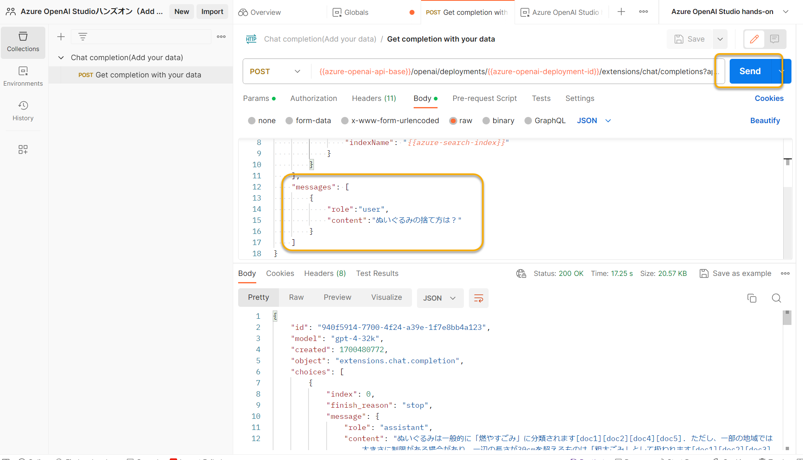

# セルフペースド ハンズオン資料

Azure OpenAI Studioを利用して、チャット（会話）形式のモデルを体験してみましょう。

- Azure OpenAI StudioでGPT-4モデルを試す
- Azure OpenAI StudioでOn your dataを試す
- (オプション)REST APIでOn your dataを試す

## 注意事項

Azure OpenAI Serviceはトークン数などに制限があります。本ハンズオンでは、みなさんに利用いただけるように環境を用意しておりますが、複数回の開催を予定しており多くの方に利用いただきたいので、節度を持った利用をお願いいたします。（とはいえ、故意に多量の入力をしたり、パラメータを上げすぎたりしなければ、大丈夫です。）

詳しくは、下記ドキュメントをご参考ください。

- [Azure OpenAI Service のクォータと制限 - Azure Cognitive Services | Microsoft Learn](https://learn.microsoft.com/ja-jp/azure/cognitive-services/openai/quotas-limits)

## Azure OpenAI StudioでGPT-4モデルを試す

### Azure OpenAI Studioを開く

まず、Azure OpenAI Studioを開きましょう。

- https://oai.azure.com/

※ 本来、Azure OpenAI Serviceを利用するには、Azureポータルなどからそのリソースをデプロイする必要があります。本ハンズオンでは、すでにデプロイ済みかつ会場の端末はAzureアカウントにサインイン済みなので、Azure OpenAI Studioを開いてすぐ利用できます。

### デプロイを確認する

次に、Azure OpenAI Serviceを利用するにはまず、モデルをデプロイする必要があります。

本ハンズオンでは、すでにデプロイを済ませてあるので、Azure OpenAI Studioの「デプロイ」画面を開き、以下のデプロイを確認しましょう。

| モデル名 | 説明 |
|----|----|
| `gpt-4-32k` | GPT-4のモデル。チャット（会話）ができる |
| `text-embedding-ada-002` | 後半の「On your data」でベクトル検索を実装する際に利用する |


### モデルを試す

それでは早速、プレイグラウンドでモデルを使ってみましょう。

まず、Azure OpenAI Studioで「チャット」画面を開きます。

ChatGPTのプレイグラウンドでは、「アシスタント セットアップ」「チャット セッション」「Configuration」のパネルがあります。


最初に、右端の「構成」の「デプロイ」の選択が、前述で確認したもの（`gpt-4-32k`）であることを確認してください。もし異なる場合は、選択し直してください。

それでは、「アシスタント セットアップ」で、セットアップを行いましょう。

「システム メッセージ」では、アシスタントの性格や、どんな振る舞いをさせるかや応答に含めてほしいコンテキストを指定します。まずは、「Use a system message template」のプルダウンから、「Empty Example」を選択してみましょう。

選択したら、「変更の保存」を選択して保存してください。「システム メッセージを更新しますか?」というポップアップが表示された場合、システム メッセージの更新によりチャット セッションでの会話の履歴が消去されることになる旨を確認されます。問題ない場合は、「続行」を選択して進めてください。

それでは、「チャット セッション」でアシスタントと会話をしてみましょう。


### 演習

しばらく自由にアシスタントとチャットを試してみましょう。

- 前の会話も考慮された返答が得られます。試してみましょう。
  - 例: 「ラーメンの種類を教えて」「人気の種類は？」
- 「システム メッセージ」にこのチャットに役割や振る舞いを指定して、会話してみましょう。
  - 例: 「あなたは、数学について詳しいアシスタントです。」

## On your dataを試す

つぎに、独自のデータに基づいた会話ができる「On your data」を試しましょう！

「アシスタントのセットアップ」の「データの追加（プレビュー）」タブを開き、「データ ソースの追加」ボタンを選択します。


「データ ソースを選択する」プルダウンで「Upload files」を選択します。


まず前半の項目を入力しましょう。

| 項目 | 値 |
|----|----|
| サブスクリプション | 選択できるリソース |
| Azure　Blob ストレージ | 選択できるリソース |
| Azure AI Search | 選択できるリソース |
| インデックス名 | `sources` |

ここで必要な「サブスクリプション」「Azure　Blob ストレージ」「Azure AI Search」はすでに用意してあるので、それぞれ選択できるものを選んでください。


**Note:** もし、Azure Blob ストレージの欄の下に「Azure OpenAI には、このリソースにアクセスするためのアクセス許可が必要です」と表示される場合は「CORSをオンにする」ボタンを選択してアクセスを許可してください。


つぎに、ベクトル検索について項目を入力します。

| 項目 | 値 |
|----|----|
| ベクトル検索をこの検索リソースに追加します | チェックする |
| 埋め込みモデル | `Azure OpenAI - text-embedding-ada-002` |
| I acknowledge that connecting to an Azure AI Search account will incur usage to my account. | チェックする |

入力できたら、「次へ」ボタンを選択して進みます。

「ファイルのアップロード」では、端末の「Downloads（ダウンロード）」にある「surface-pro-4-user-guide_ja-jp.pdf」をドラッグ アンド ドロップ（または、「ファイルを参照する」でファイルを選択）し、「ファイルのアップロード」ボタンを選択します。


**Note:** 以下のPDFを利用しています。
- [Surface Pro 4 ユーザー ガイド](https://download.microsoft.com/download/2/9/B/29B20383-302C-4517-A006-B0186F04BE28/surface-pro-4-user-guide_ja-jp.pdf)

ファイルのアップロードが終わったら、「次へ」ボタンを選択します。

「データの管理」では、以下のように入力してください。

| 項目 | 値 |
|----|----|
| 検索の種類 | ベクトル |
| ベクトルの埋め込みを追加すると、アカウントが使用されるようになることに同意します。 | チェックする |

入力できたら、「次へ」ボタンを選択します。


入力に問題がなければ、「保存して閉じる」ボタンを選択してデータの追加を完了します。


インジェストが完了するまでしばらく待ちます。


インジェストが完了したら、チャットセッションで動作を確認してみましょう。

例えば、「キーボードについて」と入力すると、以下のように返答が得られます。ここに「参照」が引用されていれば、インジェストしたデータから返答されています。


### 演習

自由にチャットで試してみてください。

データ ソースを変えたい場合は、一度「データ ソースの削除」を選択して同様の作業をしてください。

## (オプション)REST APIでOn your dataを試す

GUIのプレイグラウンドだけでは飽きてしまった人には、REST APIについても簡単にご紹介します。

プレイグラウンドの「チャット セッション」上部の「コードの表示」を選択すると、「JSON」「Python」「C#」「curl」でのサンプルコードが表示されます。

まず、「システム メッセージ」やいくつか会話をした状態で、「JSON」を見てみましょう。ここには、リクエストボディのJSONデータが表示されます。


Azure OpenAI側は状態を保持しません。そのため、システム メッセージや会話の状況は、`role`（`system`, `user`, `assistant`）を割当てて都度APIに渡しているのです。

```json
{
  "messages": [
    {
      "role": "system",
      "content": "あなたは、数学について詳しいアシスタントです。"
    },
    {
      "role": "user",
      "content": "こんにちは"
    },
    {
      "role": "assistant",
      "content": "こんにちは！数学に関する質問があれば何でもお答えします。どのようにお手伝いできるでしょうか？"
    },
    {
      "role": "user",
      "content": "サインの書き方は？"
    },
    {
      "role": "assistant",
      "content": "サインは、通常 \"sin\" と表記されます。例えば、角度 A のサインは \"sin A\" と書きます。これは三角関数の一つで、直角三角形において対辺の長さを斜辺の長さで割った値を表します。また、単位円（半径1の円）を用いて定義することもでき、その場合は角度が半径と形成する弧の長さに対応し、その弧の終点のy座標がsinの値となります。"
    }
  ],
  "temperature": 0,
  "top_p": 1,
  "frequency_penalty": 0,
  "presence_penalty": 0,
  "max_tokens": 800,
  "stop": null
}
```

その他にパラメータについては、ドキュメントをご参照ください。

- [Azure OpenAI Service の REST API リファレンス - Azure OpenAI | Microsoft Learn](https://learn.microsoft.com/ja-jp/azure/ai-services/openai/reference)

つぎに、独自データを扱う場合を見てみましょう。「JSON」では確認できないので、「Python」「C#」「curl」でコードを確認します。ここでは、「curl」を例に進めます。

「データの追加」を行った状態で、「curl」のコードを確認すると、リクエストボディに`dataSources`が追加されていることがわかります。


```json
{
  "dataSources": [
    {
      "type": "AzureCognitiveSearch",
      "parameters": {
        "endpoint": "<search_endpoint>",
        "key": "<search_key>",
        "indexName": "<search_index>"
      }
    }
  ],
  "messages": [
    //...
  ]
}
```

ここで、REST APIのコールを試したい方は、端末にPostmanを用意しているのでご利用ください。

以下にREST APIの構成を保存したCollectionとEnvironmentを用意しので、それぞれリンクを右クリックしてURLをコピーして、Postmanの「File」→「Import」にてインポートしてください。

- Collection: [Chat completion(On your data).postman_collection.json](https://raw.githubusercontent.com/dzeyelid/aoai-studio-handson/update-202311/docs/on-your-data/samples/postman/Chat%20completion(On%20your%20data).postman_collection.json)
- Environment: [Azure OpenAI Studio hands-on.postman_environment.json](https://raw.githubusercontent.com/dzeyelid/aoai-studio-handson/update-202311/docs/on-your-data/samples/postman/Azure%20OpenAI%20Studio%20hands-on.postman_environment.json)

Environmentには「curl」のコードなどを参考に設定します。


| PostmanのVariable | 「curl」によるコード表示での値 |
|----|----|
| `azure-openai-key` | ウィンドウ下部の「キー」 |
| `azure-openai-api-base` | コード中の`api_base` |
| `azure-openai-deployment-id` | コード中の`deployment_id` |
| `azure-search-resource-key` | ウィンドウ下部の「Azure Search リソース キー」 |
| `azure-search-index` | コード中の`search_index` |
| `azure-search-endpoint` | コード中の`search_endpoint` |

Environmentが設定できたら、「Set as active environment」を選択して有効にしてください。


Collectionの「Get completion on your data」を開き、リクエストボディの`messages`を自由に変更して、送信してみましょう。データ ソースの内容を参照したレスポンスを得られることを確認できます。



さて、ここまでREST APIについてご紹介しましたが、これを実際の開発で利用することはちょっと大変です。REST APIを直接利用する場合はストリームの維持やレスポンスの分解・構成などを実装しなくてはなりません。そこで、各言語向けに提供されているAzure SDKが提供されているので、それを利用する方が現実的です。ご興味ある方はご参考ください。

- [JavaScript](https://learn.microsoft.com/ja-jp/javascript/api/@azure/openai/?view=azure-node-preview&preserve-view=true)
- [.NET](https://learn.microsoft.com/ja-jp/dotnet/api/azure.ai.openai?view=azure-dotnet-preview&preserve-view=true)
- [Go](https://pkg.go.dev/github.com/Azure/azure-sdk-for-go/sdk/ai/azopenai)
- [Java](https://learn.microsoft.com/ja-jp/java/api/com.azure.ai.openai?view=azure-java-preview&preserve-view=true)
